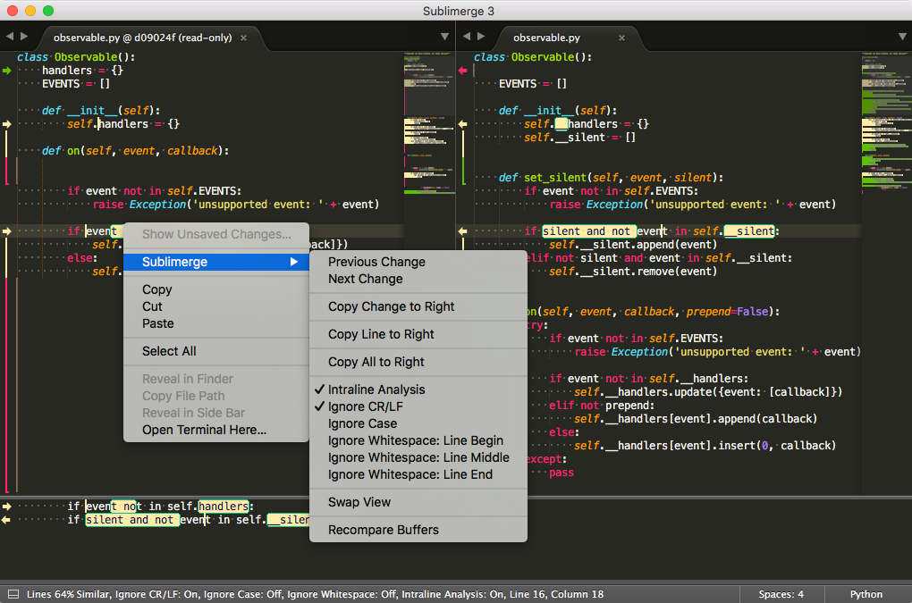
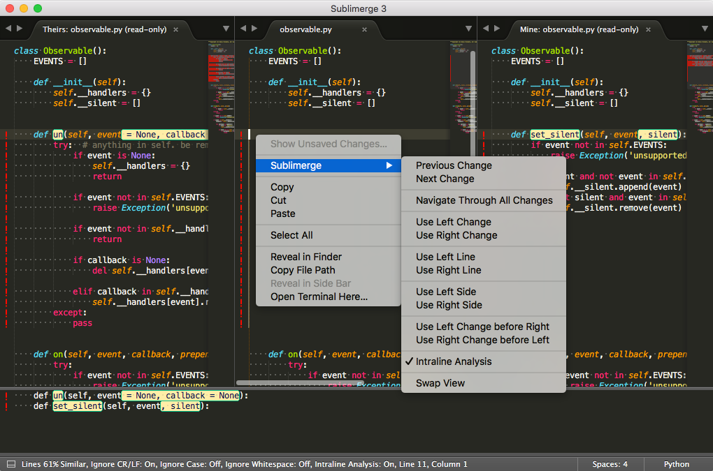
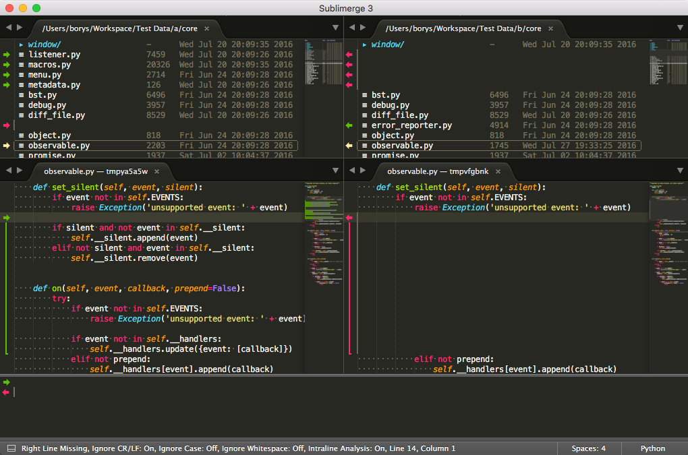
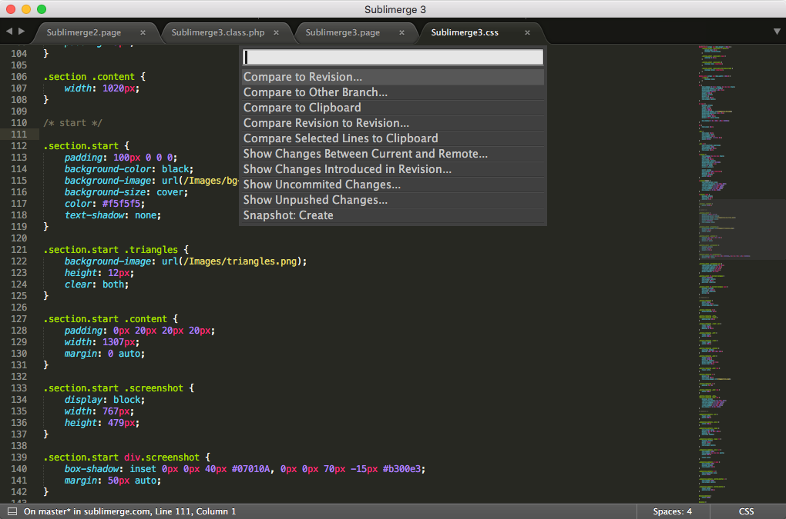

Sublimerge 3 (WINDOWS ONLY)
=====================================

### Forked from [Sublimerge 3](https://packagecontrol.io/packages/Sublimerge%203)

The purpose of this fork is to preserve sublimerge 3 as it has been taken down. website no longer exists so I will NOT link it for security reasons. I do not claim any ownership of this packge, all the credit goes to Borys Forytarz for thier work.

___

Sublimerge is not yet another diff plugin for Sublime Text. It is the most advanced, full-featured plugin which will turn your favorite editor into the professional diff and merge tool with amazing features! Your time is your money so no longer waste it. Forget switching again and again to external apps - now you get it all built-in!

                

###  How does it differ from other plugins?

* No external tools needed. Side-by-side two-way and three-way diff that runs right inside Sublime Text!
* Interactive. Pick and edit differences. Unlike in other plugins, the diff view is editable.
* Two-way Diff. Easily compare the files side-by-side. Run from Sublime or command line.
* Three-way Diff. Integrate with your VCS and use Sublimerge's advanced features to resolve merge conflicts.
* Live Diff. The diff views are editable. Type, cut, copy, paste and delete. Just like in the best diff tools available on the market.
* Patience diff algorithm. The best diff algorithm for source code is enabled by default.
* Directories Diff. Compare directories side-by-side right in Sublime Text.
* Undo & redo. We all make mistakes. Don't afraid them any longer. Sublimerge's undo/redo stack is unlimited.
* Scroll sync. The diff panes are in sync with each other. Scroll one, the other will sync automatically.
* Readable & clean interface. The differences are marked with colorful lines. Intraline changes are easy to spot.
* Full integration. Use Sublimerge to compare opened files, selections, clipboard and much more.
* Supports Git, Mercurial and Subversion. They are supported out of the box. Compare working copy & revisions.
* Extendable. Easily implement your own diff commands using the Macros feature.
* Integratable. Run Sublimerge from command line and integrate with anything.
* Configurable. Configure anything! Colors, behavior, commands, diff algorithm and more.

# Text Diff
Sublimerge 3 makes it extremely easy to work with compared files. All the differences are marked in the gutter so the text area remains clear and waits for your input. All your modifications are immediately reflected as you type. Cut, copy & paste the text. Thanks to unlimited undo/redo stack you don't have to worry about mistakes. It all just works.

# Three-way Text Diff
Configure Sublimerge as your diff & merge tool and resolve conflicts easily right in your editor. Advanced merging capabilities will be your secret weapon. Resolve conflicts one-by-one by using advanced merge commands. If it's still too less, remember that Live Diff also works in three-way mode!

# Directories Diff
Sublimerge compares directories side-by-side, digging down in the hierarchy. When a directory contains any difference at any level, it gets marked as different. When you find differences, you can simply clone files or directories from one side to the other. You can also run Text Diff for selected text files right in the same window!

# Version Control Systems
Sublimerge comes with predefined commands that will improve your workflow with versioned files. For instance, you can quickly compare your working copy to any revision. You can even view, verify and revert uncommited changes. That's magically simple. If this is still too less, you can define your own commands using Macros feature.

# Live Diff
Edit the files directly in the diff view. All changes will be automatically updated as you type. Works in both 2-way and 3-way diff!

# Undo & Redo
Unlimited undo and redo stack will let you fix the mistakes.

# Full Sublime Text integration
Sublimerge fully integrates into your editor, no matter what your operating system is. Forget about external tools just to check differences between files, their revisions or even their fragments. You get it all built-in. Out of the box.

# Simplicity & Productivity
Everything you need to do is to learn a few keyboard or mouse shortcuts to make your work with diffs more productive. If you are lazy, every command is available from context menus and Command Palette. Just that simple.

# Snapshots
Create snapshots of your code to store temporarily important changes. Later merge your changes from snapshots or even fully revert to given point in time. Snapshots can be created manually and/or each time you open or save file.

# Showing differences
Colorful gutter lines will show you clearly which fragments are different or missing. Intraline changes will be also highlighted to help you focus your eyes on small differences.

# Macros
Define macros where you can decide what and how to compare. Sublimerge comes with a few predefined Macros for Git, SVN and Mercurial users which allows you to compare and merge files across branches and view uncommited changes. You can also define your own macros to do custom things.
